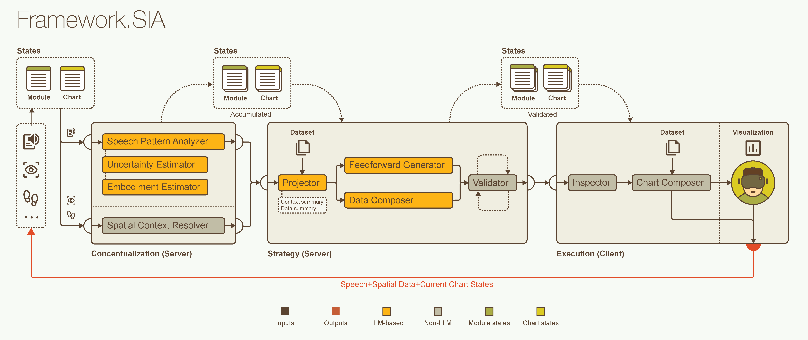

# SIA: A Framework for Context-Aware Intent Clarification in Speech-Driven Immersive Analytics

<p align="center">
  
</p>

This repository contains the SIA client-server prototype for speech-driven immersive analytics in VR.

For public-release scope, contracts, and known limits, see [SIA-Server/REPRODUCIBILITY.md](SIA-Server/REPRODUCIBILITY.md).

## Repository Structure

```
SIA_Ver1_Full/
├── images/
├── README.md
├── SIA-Client/                        # Unity project (open this folder in Unity)
│   ├── Assets/SIA/Scripts/            # Main C# scripts
│   ├── Packages/
│   ├── ProjectSettings/
│   └── ...
└── SIA-Server/                        # FastAPI server
    ├── main_server.py
    ├── requirements.txt
    ├── speechPatternAnalyzer/
    ├── spatialContextResolver/
    ├── feedforwardGenerator/
    ├── dataComposer/
    ├── projector/
    └── validator/
```

## Architecture Overview

The system processes speech-driven multimodal interaction inputs through the following pipeline:

```
┌─────────────────────────────────────────────────────────────────────────┐
│                              SERVER                                     │
├─────────────────────────────────────────────────────────────────────────┤
│  0. Chart, Module Spec → Templates                                      │
│  1-1. Speech Input → Whisper transcription                              │
│  1-2. Multimodal Inputs → Receiving from Client                         │  
│                                                                         │
│  2. Conceptualization                                                   │
│     ├── Speech Act Extractor → Speech act extraction                    │
│     ├── Speech Pattern Analyzer                                         │
│     │   ├── Uncertainty estimator → Task inference                      │
│     │   ├── Embodiment estimator → Embodiment tendency inference        │
│     │   ├── Prototypical Network → Task inference                       │
│     │   └── Calibration → LLM + Network confidence fusion               │
│     └── Spatial Context Resolver → Gaze/head tracking resolution        │
│                                                                         │
│  3. Strategy                                                            │
│     ├── Projector → Direction Generation                                │
│     ├── Feedforward Generator → Next user action candidates                  │
│     ├── Data Composer → Chart specification updates                     │
│     └── Validator → Schema validation (Chart Spec)                      │
│                                                                         │
│  Once validated, Parsing Module Spec + Chart Spec to Client             │
└─────────────────────────────────────────────────────────────────────────┘
                                    │
                                    ▼
┌─────────────────────────────────────────────────────────────────────────┐
│                              CLIENT                                     │
├─────────────────────────────────────────────────────────────────────────┤
│  4. Execution                                                           │
│     ├── Inspector → Inspect and automatic edit the Chart Spec           │
│     ├── Chart Composer → Change chart based on Chart/Module Specs       │
│     └── HMD → Sending speech + multimodal data to Server                │
└─────────────────────────────────────────────────────────────────────────┘
```

## Dependencies

**Server**
- Python 3.9+
- See `SIA-Server/requirements.txt` for dependencies

**Client**
- Unity 2021.3.4f1 (tested on 2022.3.16f1)
- Meta XR SDK (restored automatically from `SIA-Client/Packages/manifest.json`)
- IATK (included in `SIA-Client/Assets/IATK` in this repository)
- Open `SIA-Client` directly as a Unity project
- Main client-server request flow is implemented in `SIA-Client/Assets/SIA/Scripts/Server/SpeechSender.cs`

**Hardware**
- Meta Quest Pro (with Quest Link)

## Installation

1. Install Python 3.9+.
2. Install server dependencies:

```bash
cd SIA-Server
pip install -r requirements.txt
```

3. Prepare OpenAI credentials at `%USERPROFILE%/.openai/auth.json`:

```json
{
  "api_key": "YOUR_OPENAI_API_KEY",
  "organization": "YOUR_KEY"
}
```

4. Prepare prototypical-network runtime data folder `NLA_dis7alpha5_data`.
5. Open `SIA-Client` as a Unity project (Unity Package Manager restores Meta XR SDK packages automatically).

## Running

1. Start the server:

```bash
cd SIA-Server
uvicorn main_server:app --reload --host 0.0.0.0 --port 8000
```

2. Open `SIA-Client` in Unity.
3. Set the server URL in `SIA-Client/Assets/SIA/Scripts/Server/SpeechSender.cs` (Server Url field).
4. Run the SIA scene in Play Mode using Quest Link.

## Citation
If you use this work, please cite:
Song, H., Whitley, K., Krokos, E., & Varshney, A. (2026). SIA: A Framework for
Context-Aware Intent Clarification in Speech-Driven Immersive Analytics.
In Proceedings of the 31st International Conference on Intelligent User Interfaces
(IUI '26), pp. 1687–1703. ACM. https://doi.org/10.1145/3742413.3789063

## License
This work is licensed under a Creative Commons Attribution-NonCommercial-NoDerivatives 4.0 International License.

Copyright held by the owner/author(s).
This artifact is associated with the ACM publication below:

- ACM ISBN 979-8-4007-1984-4/26/03
- https://doi.org/10.1145/3742413.3789063

For reuse and redistribution, follow the publication and rights information above.

